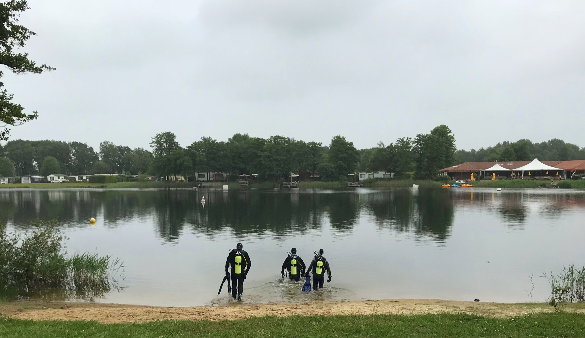

## Learning how to dive

Have you never been scuba diving but would you like to learn? At our club this is possible! We give scuba dive education from swimming pool lessons up to diving in the deep blue. Below you’ll find in impression of what you can learn at our club.

## Dive safely at Ad Fundum

Diving is a relatively safe sport in comparison to other activities. However you enter a realm where you do not belong naturally and that is why at Ad Fundum you get extensive training with the focus on safety. Our solid training program will guarantee your safety under water. You will always dive with a ‘dive buddy’, this will make your dive safer and more fun. Furthermore you will have to pass a scuba dive medical examination in order to make sure your body can handle diving. Don’t worry, usually this does not pose a problem, not even with for example a mild forms of asthma.

## Learning how to dive is no rocket science

Diving is a skill you need to master. If you acquired this skill, diving is easy. In our dive training you learn how to master the right techniques. In our experience, anyone can be thought how to dive. You don’t even have to be an excellent snorkeler or swimmer. If you are able to cross some lanes in the pool, diving should not pose a serious problem.

## Diving indoors

Starting in October until spring you will have theory lectures / lessons prior to the pool training. Here you learn about diving equipment, safety, health issues, diving techniques and so on. In the pool we will teach you how to snorkel and you will learn the basic scuba diving skills. The snorkel training forms the basis for your swimming skills and breathing under water. Next to this you will have lessons with scuba gear so you can familiarise yourself with the equipment in order to have an optimal start once you start diving into the ‘real’ water outside.

## Diving outside

If you complete your indoor training, around April you will be ready for the real deal: your outside scuba diving education will commence in one of the freshwater lakes in the vicinity of Groningen. During these Ad Fundum Weekends you can work towards your first license at your own pace. Each year we will organize several of these weekends. Furthermore we organize frequent trips to Zeeland where you can also advance your diving skills for example with diving in currents or in (much) deeper water.

## License

Ad Fundum is part of the Nederlandse Onderwatersport Bond (the “NOB”, the Dutch Association for Underwater Sports (like Scuba Diving)). Our licenses are accepted worldwide. This is the case because the NOB is affiliated with the international organization CMAS (Confédération Mondiale des Activités Subaquatiques). CMAS can be compared with other international organizations like PADI, NAUI and SSI. Do you already have a license from one of these organizations? You can continue diving with us at a predetermined CMAS level and can even commence your education in the CMAS system.
