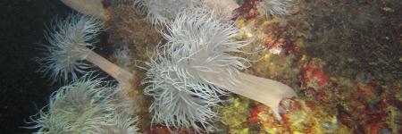
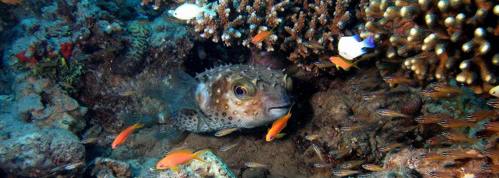

“Diving in the Netherlands?! That’s extremely cold, you won’t see a thing and there is no live to be found anywhere!” This is something people who do not know how it is to dive in The Netherlands frequently say. However, this cannot be further from the truth! Diving in in our country is great!

In order to handle the cold, you can simply wear a diving suit (at least 7mm). It can actually be even very warm, especially with new suits. About the visibility: it is not a tropical diving paradise where you can see further than 20 meters; visibility in The Netherlands is usually between 3 and 10 meters; less when you are out of luck and sometimes it is even more than 10 meters when you are lucky. And believe us, this is not an issue, it makes it only more exciting.

True, the underwater life is not that colorful like in tropical places but you will still find beautiful creatures, and lots of them! Zeeland is one of the places which has the most underwater life in the entire world so it is not that strange that people from all over the world visit our country in order to dive.

We invite you to dive with us and discover the Dutch underwater world.

# Tynaarlo

Tynaarlo (camping ’t Veenmeer) is one of our common diving spots to train. It is only 10 minutes south of Groningen by car.
All ingredients for an effective and interesting dive training are present. You can get in and out of the water easily. The ground is usually sandy, there are platforms at several depths to do your exercises, there is a buoy with a large chain indicating the deepest point of 15 meters. Visibility normally varies from 1,5 to 5 meters.

Tynaarlo is not only suited for dive training, you can also make fun dives. A lot of the underwater fish species in fresh water pools can be found here: pike (varying from small to very large), ale, large schools of perch, roach, fresh water lobsters, plant life, sometimes you can spot (ex-domestic) turtles. You can also find may objects: a helicopter simulator, street signs, little boats, Christmas trees, car tires, a toilet and a huge delta flyer.

Red-tailed Turtle

This diving spot has something to offer for everyone. You can bathe in the sun, relax on the grass, socialize with other divers (or the guests you bring along). The spot is well suited for night dives. You can also spend the night there if you bring your own tent. This way you can be in the water very early.

# Zeeland

Zeeland has the most beautiful diving spots of The Netherlands. We dive in both the Grevelingen (non-current) and the Oosterschelde (current / tidal water). This is a guarantee for finding a lot of underwater life, for example large red lobsters. The tidal water in the Oosterschelde makes diving more challenging, it usually means that at certain times the visibility is less optimal. Nevertheless, you can find beautiful sea life, like large lobsters and the world famous sepia’s. The most exiting dives are the ones during the night in tidal water.

Plaice

Ad Fundum frequently organizes weekend trips to Zeeland. We usually go there on a Friday and return on Sunday and stay within caravans on the middle of the island (Schouwen-Duivenland). From here we explore Zeeland. These weekends guarantee coziness, excitement and beautiful dives.

# Other dive spots

Some examples of other place we visit, worth visiting:

Ruinerwold, “The most beautiful lake in the North” is how some people call it. It is comparable to Tynaarlo but with more life, better visibility and more fun in diving. It is 50 minutes’ drive from Groningen.

Joure, a deep well with very dark but at the same time clear water. You need a diving light. This lake is almost 20 meters deep everywhere and you can find huge pikes. Joure is one hour from Groningen.

The Piccardhof Plas, lies within the city of Groningen but usually has poor visibility, it is about 25 meters deep, it has dangerous object but nevertheless there is a lot of underwater life. (Diving is illegal though!)

Geeste, lies in Germany, one and a half hours outside of Groningen. It serves as a cooling basin for a nuclear power plant. It looks as if the radiation affected the underwater life in a way that ale are numerous and perch are very large. Geeste is most beautiful during a night dive. If you only have seen 10 ales, you certainly need to come back!

Ibbenburen, is an underwater park in Germany. You’ll find Greek temples, caves with frequent exits, a shipwreck and sturgeons up to 2 meters. A must see for everyone!
